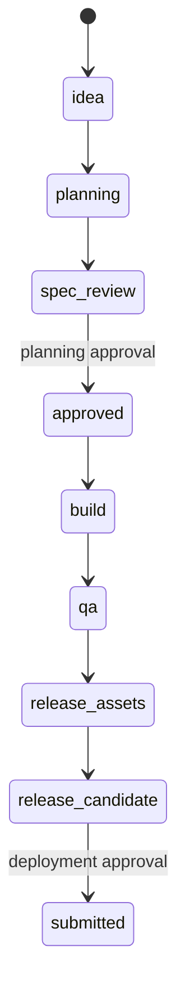

# Planning

새 프로젝트는 이 폴더에서 시작한다.

## 상태 흐름

## 원칙

- planning approval 전에는 package name, bundle ID, Firebase project, store app을 확정하지 않는다.
- 제품별 확정값은 `product-spec.md`와 `release-targets.md`에 먼저 기록한다.
- 승인 전 placeholder는 `확정 필요`로 유지한다.

