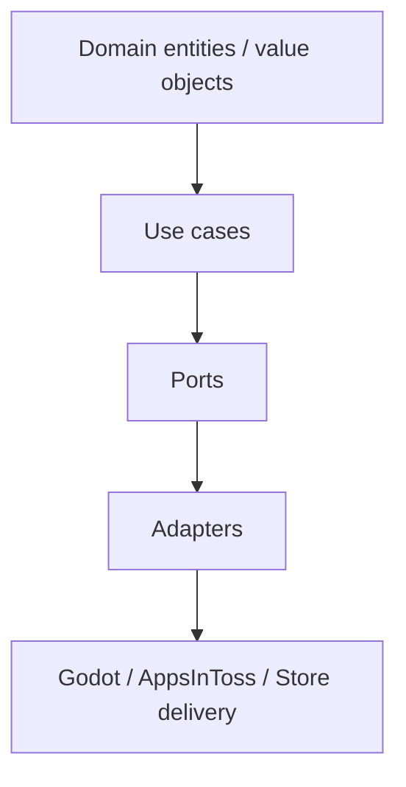

# Architecture

이 템플릿은 Clean Architecture를 기본값으로 둔다.

## 레이어 규칙

- 안쪽 레이어는 바깥 레이어를 모른다.
- core는 Godot, Firebase, store SDK, device API를 직접 참조하지 않는다.
- adapter는 port를 구현하고 composition root에서 주입한다.
- Godot scene/script는 렌더링, 입력, lifecycle, presentation orchestration을 담당한다.

