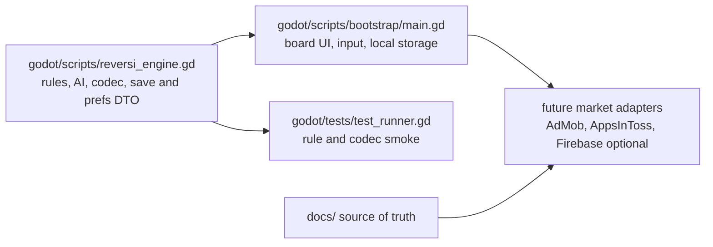

# Clean Architecture Boundary

## Current Shape

## Godot Pure Core

`godot/scripts/reversi_engine.gd`는 Phase 1의 실제 순수 코어다.

허용:

- 리버시 규칙
- 합법 수 계산
- 패스와 게임오버 판정
- 난이도별 AI 선택
- MEDIUM/HARD 동점 최선 수의 대국별 seed 선택과 save/undo 재현
- 크기 태그 가변 보드 codec과 기존 18-byte 8x8 codec 읽기 호환
- 게임 save와 사용자 prefs DTO 변환

금지:

- `extends Node`, `extends Control`
- scene tree, UI, input, animation 직접 접근
- Firebase, AppsInToss, AdMob, Store SDK 직접 접근
- 파일 시스템 직접 접근

## Godot UI Adapter

`godot/scripts/bootstrap/main.gd`는 Phase 2 플레이어블 shell이다.

허용:

- 화면 구성
- 보드 입력
- 대국당 1회 결과 카드·승자 강조 연출과 reduce-motion 우회
- 대국 저장소 `user://save_v1.json`
- 게임 세이브와 분리된 사용자 환경설정 저장소 `user://prefs_v1.json`
- 착수 표시를 포함한 설정 toggle
- AI 턴 호출

금지:

- 리버시 flip 규칙 재구현
- 마켓별 SDK 직접 연결

## packages/product-core

템플릿의 장기 Clean Architecture scaffold로 유지한다.

허용:

- Domain entities
- Value objects
- Pure use cases
- Port interfaces
- Pure fixtures/fakes

금지:

- Godot scene tree, Node, Control, Resource 의존
- Firebase SDK, Admin SDK, service account
- AppsInToss SDK
- Google Play Billing, App Store StoreKit
- Ad SDK
- Network/client SDK 직접 호출

## Market Adapters

시장별 release, metadata, config, wrapper는 다음 위치에 둔다.

- Google Play: `play-store/`
- App Store: `app-store/`
- AppsInToss: `apps-in-toss/`, `apps/ait/`
- Firebase: `firebase/`
