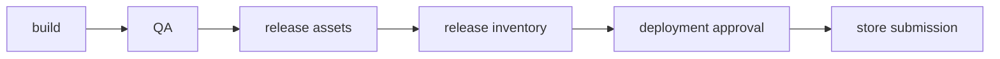

# Release

릴리스 후보와 배포 체크리스트를 관리한다.

## Gate

```mermaid
flowchart LR
  Build["build"] --> QA["QA"]
  QA --> Assets["release assets"]
  Assets --> Inventory["release inventory"]
  Inventory --> Approval["deployment approval"]
  Approval --> Submit["store submission"]
```

Deployment approval 전에는 production 제출/승격을 하지 않는다.

