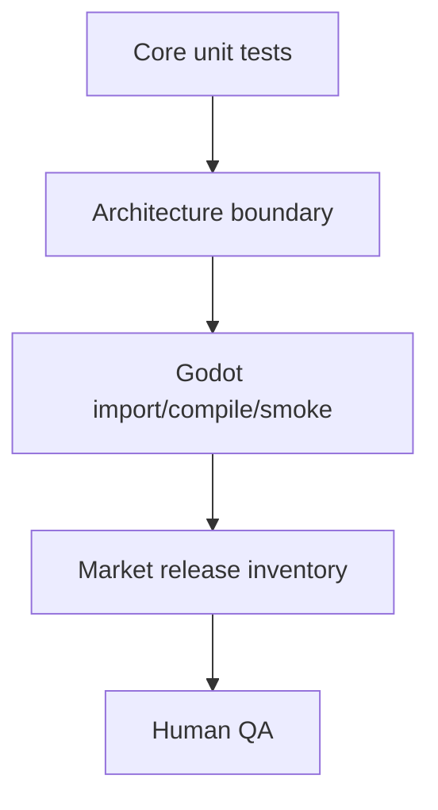

# QA

QA 문서와 테스트 전략을 관리한다.

## Test Layers

```mermaid
flowchart TB
  Core["Core unit tests"] --> Arch["Architecture boundary"]
  Arch --> Godot["Godot import/compile/smoke"]
  Godot --> Market["Market release inventory"]
  Market --> Human["Human QA"]
```

