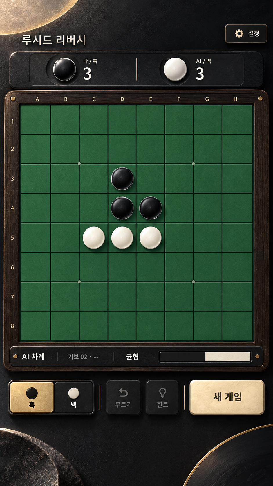
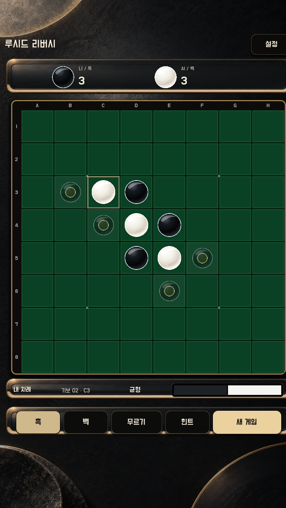
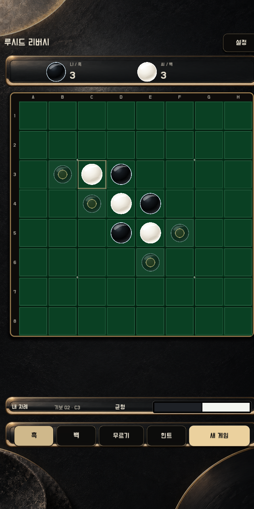
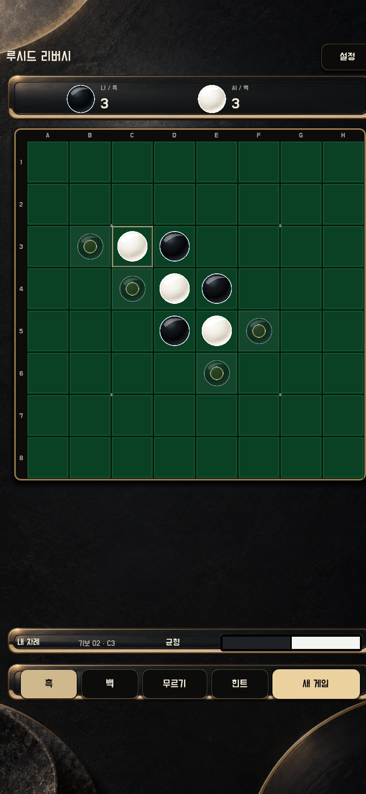

# Moonlit Lacquer UI

## 승인

- 사용자가 2026-09-18에 대표 화면 시안 B를 선택했다.
- 기준 이미지는 [reference-moonlit-lacquer.png](reference-moonlit-lacquer.png)다.
- 이 문서는 대표 대국 화면과 이후 UI 화면의 시각 기준이다.

## 목표

- 보드를 가장 큰 상호작용 대상으로 유지한다.
- 점수 트레이, 보드, 상태 밴드, 조작 트레이가 하나의 물리적 게임 세트처럼 보이게 한다.
- 기존 리버시 규칙, 저장, 언어, 테마, 설정 정보 구조는 바꾸지 않는다.
- 한국어·영어·일본어 텍스트를 모두 Godot에서 렌더링해 이미지 생성 결과와 분리한다.

## 대표 화면 구조

1. 상단: 작은 제품명과 설정
2. 보드 직상단: 흑칠 점수 트레이 안의 나·AI 점수
3. 중앙: 화면 너비를 우선 사용하는 8×8 보드
4. 보드 직하단: 차례, 기보, 우세, 흑백 비율을 합친 상태 밴드
5. 하단: 흑·백 선택, 무르기, 힌트, 새 게임

## 구현 기준

- GPT Image로 만든 배경과 9-slice 패널을 실제 런타임에 사용한다.
- 버튼은 같은 재질 팔레트의 코드 기반 상태 스킨을 사용한다. 기능 글자와 상태를 래스터 이미지에 넣지 않는다.
- 선택 상태는 따뜻한 상아색 면, 기본 상태는 흑칠 면이다.
- pressed는 그림자 깊이를 줄이고 면을 어둡게 해 눌림을 색상 외 형태 변화로도 구분한다.
- disabled는 그림자를 없애고 글자·테두리 대비를 낮춘다.
- 보드 프레임은 숯색, 3px 황동 테두리, 아래 방향 그림자를 사용한다.
- 클래식 보드 녹색은 기존보다 채도를 낮춰 상아색 돌과 상태 표시가 먼저 읽히게 한다.

## 시각 검수

- 기준 상태: 8×8, 흑·백 각 3개, 두 수 진행 상태
- 기준 뷰포트: 720×1280
- 추가 확인: 640×1280 좁은 세로 화면, 720×1560 긴 세로 화면
- 판정: 보드가 최우선으로 읽히고, 기능 텍스트가 배경 이미지와 겹쳐도 식별되며, 하단 조작이 보드와 경쟁하지 않아야 한다.

| 선택 시안 | 720×1280 실제 런타임 |
| --- | --- |
|  |  |

| 640×1280 | 720×1560 |
| --- | --- |
|  |  |

검수 결과:

- 세 크기 모두 보드, 좌표, 합법수 고스트, 점수와 하단 조작이 잘리지 않는다.
- 선택 시안의 흑칠 점수 트레이, 황동 테두리, 따뜻한 주 버튼, 보드 우선 위계를 실제 렌더에서 유지한다.
- 긴 화면에서는 보드와 하단 상태·조작 트레이 사이에만 여유 공간을 배분해 보드 위치와 크기를 고정한다.
- 시안의 장식용 큰 원형 요소는 플레이 가독성을 위해 배경 가장자리로 제한했다.

실기기 터치 QA와 마켓 스크린샷 갱신은 이 변경의 범위에 포함하지 않는다.
